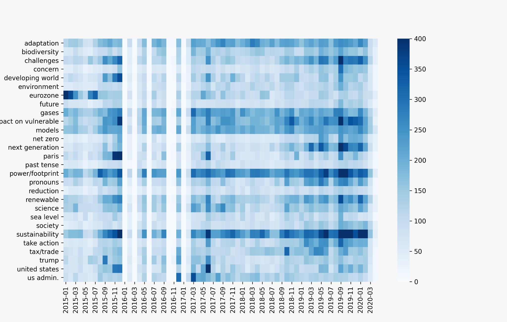
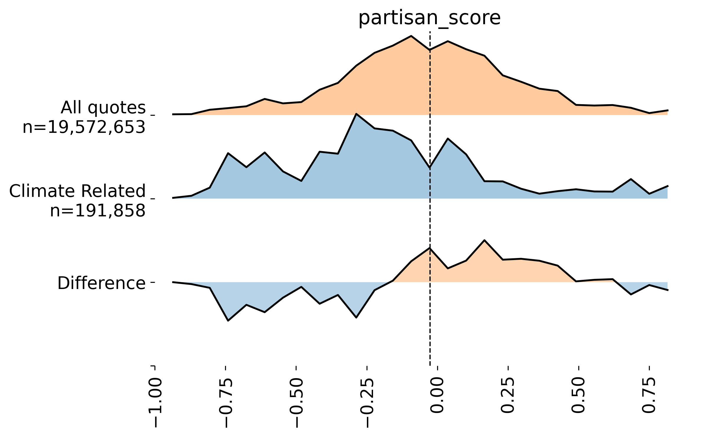
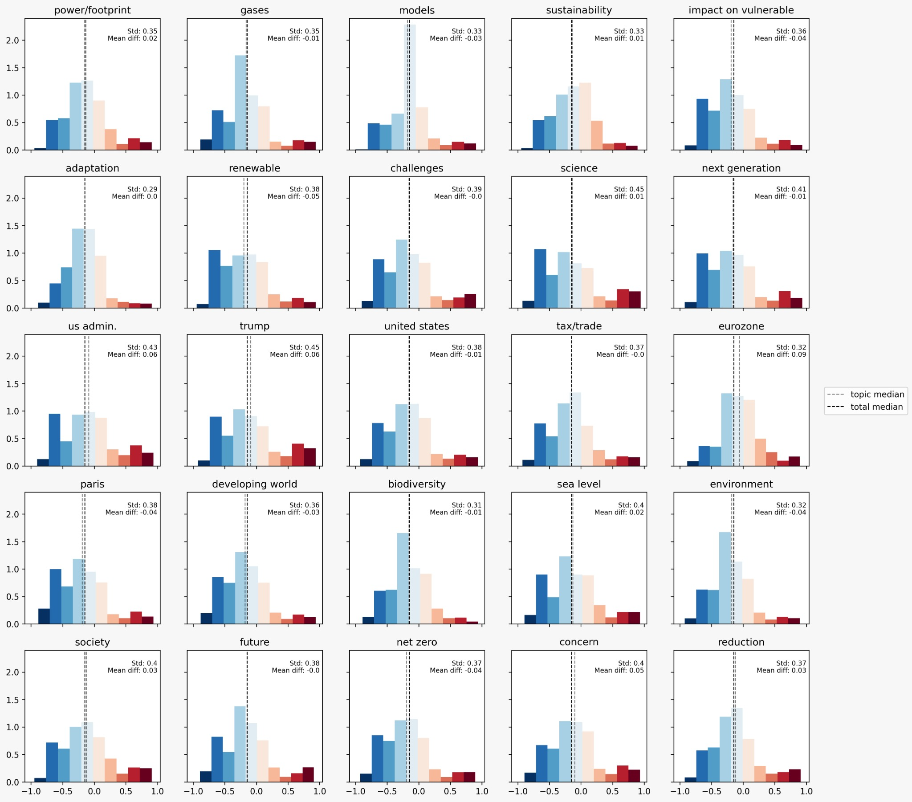

## Motivation
>“Global warming is likely to be the greatest threat of the 21st century.” 

Climate change refers to long-term shifts in temperatures and weather patterns. These shifts can be natural, such as through variations in the solar cycle. 
Nevertheless, since the 1800s, human activities have been the [main driver of climate change](https://www.ipcc.ch/site/assets/uploads/sites/2/2018/12/ST1.5_OCE_LR.pdf), more precisely in global warming. Indeed, in the last decades we observe a general increase in average temperatures of the Earth, which modifies the weather balances and ecosystems. At the pace of current CO2 emissions, scientists expect an increase of between 1.5° and 5.3°C in average temperature by 2100. If no action is taken, it will have harmful consequences to humanity and the biosphere. 

It is critical that these scientific *facts* be widely dissimenated and understood by the general population. This will empower the public to take the necessary steps to curb climate change and reduce their carbon footprint. This topic is hugely relevant today and for future generaitons, and it is critical that we understand how the media discusses climate change to form our campaigns and future research efforts. 

## Goal
We want to understand how to create a productive awareness campaign about climate change. Using “Quotebank" \[1\] and Robertson's \[2\] website political scores, we quantify the climate change landscape in the media over the last five years. This article will serve as our foundation when forming our future climate change awareness campaigns. 

## Research Questions
Throughout this article we will answer the following questions:
* What were the topics and events that triggered conversation about climate change?
* Who are the main personalities driving the climate change discussion?
* Which news sites focus most on climate change?
     * What issues do they focus on?
* How are the issues politicized?
* Is climate change getting more polarized? 
       
## The data
We built our dataset from Quotebank, an open corpus of 178 million quotations attributed to the speakers who uttered them. These quotes were extracted from 162 million English news articles published between 2015 and 2020. Additionally, we filtered the dataset and took only climate change related quotes.

We wanted to have as much data as possible to have an accurate analysis. The final climate change database is composed of: 

       Quotes                            Speakers                            Domains  
       260'924                            178'716                             7'782 

{: .box-note}
       
#### Now let's turn to analyzing the data! 

 <h1>Is conversation about climate change constant over time?</h1> 

Let's start broadly by analysing the evolution of climate change quotes in the last 5 years:

  <b> Figure 1:</b> <i>Number of quotes about climate change over time.</i>  

We see that the climate change discussion has evolved over the years, featuring several peaks that correspond to key events taking place globally. 
We aim to track these key events by analyzing events that took place throughout the years. 

* November 2015 : "Pope Francis encourages bishops from around the world to sign an appeal to world leaders, meeting in Paris next month, for crucial climate change talks." 
* June 2017 : The 1st of June "United States withdrawal from the Paris Agreement"
* June 2019:  "The House of Representatives of the Netherlands passes the final bill of the climate agreement. The goal of the accord is to have the level of greenhouse gasses in the atmosphere in 2030 the same as the level of greenhouse gasses in the atmosphere in 1990."
* September 2019:  "Millions of young people take to the streets and numerous businesses worldwide go on strike days before the UN Climate Summit, demanding that further action be taken to confront climate change." 
       
      
### Main Topics of Climate Change 
 
{: .box-}
**Technical aside:** Thanks to LDA we are able to determine different topics within the climate change quote! 

If there is one thing Greenpeace knows it's that the way climate change is invoked can vary widely. Some people may focus on its business implications, others will be more concerned with the environmental consequences. To better grasp this nuance, we run topic modelling to uncover some of the latent concepts that are invoked with climate change. Below are the thirty topics we found, alongside the top 20 words for each topic.  
 

 <b>Figure 2:</b> <i> 30 topics and the top 20 words in each topic.</i> 

       
We observe a diversity of subtopics like financial, environmental, society, political aspects and many more. **These topics uncover the subtext that is present when climate change quotes are invoked.**
       
By understanding the issues that are intrinsic to climate change, we will be able to see which issues have been raised at which time.
       
### Evolution of topics over time

  

 <b>Figure 3:</b> <i>Monthly occurance of topics between 2015 and 2020. The database is missing data for a few months in 2016.</i> 

       
Tracking the evolution of climate interest reveals hot-topics and how they evolve. For example, while the Paris Agreement was a hot-topic in November 2015 and 2017 (when Trump pulled out), its interest declined in other months. On the other hand, interest for sustainability and finance tends to persist more consistently. Additionally, the Eurozone and Europe were key issues with climate change in the beginning of 2015. 

In general, we find that pressing issues like gases, impact on vulnerability, power, footprint and sustainability have a lasting interest. But topics related to events like the Paris Agreement, the strikes in 2019, or even what Trump receive less consistent attention. 

       
### Are more people talking about climate change? 
       
We performed a linear trend curve and observed a minimal increase of quotes per month that was not statistically significant. Indeed, the flat slope indicates that climate change did not see a large increase throughout the years. Furthermore, the spikes in the graph reveal the events the trigger conversation about climate change.  
      

 <h1>Who talks about climate change? </h1> 

Over the last five years, here are the people that were most quoted in relation to climate change:

_Do the most quoted people talk mostly about climate change?_

 

 <b> Figure 4:</b> <i>Most quoted speakers.</i> 

It seems not! Surprisingly, on average a third of speakers' quotes are about climate change. 

*Are there trends between the most quoted speakers?* 
To answer this question we delve into the backgrounds of the speakers on climate change. Metadata on the speakers was extracted from Wikidata, a large knowledge base containing volunteer-inputed information about entities. We find that climatologists and scientists more generally are more likely to be quoted about climate change, whereas athletes and artists are less likely to speak about climate change.

 <b> Figure 5:</b> <i> Top 5 and bottom 5 occupations among speakers, as a proportion of their quotes that revolve around climate change.</i> 

 <h1>Who said "embedding"?</h1> 

#### Connecting speakers and sites in an **al-gore-ithmic embedding**.
       
Understanding climate change related quotes requires uncovering both the speakers and where the quote takes place. We develop a high-fidelity embedding of news sources where similarity is measured by commonality in who the site quotes. **Two sites are then close if they share a lot of speakers, and far away if they have little similarity in the speakers**. Simply put, this embedding is created through a latent semantic analysis (PCA on the tf-idf matrix), where the documents are sites and words are speakers. 

The embedding is capable of effectively clustering news sites into coherent groups. The clusters are both based on topical similarity (fashion, sports, climate, news, and finance) and geographic proximity, which are captured in the KMeans clustering we do on the space. Here we include a small video of the embedding, but the full embedding can be played around with <a href="https://projector.tensorflow.org/?config=https://gist.githubusercontent.com/vminvsky/45b24d87668ee39c42ed431e2a510696/raw/a89a3cb6d46d9baf7ae5c6001ee07613f1c94353/quotebank_embedding">here</a>

 <b> Visualization:</b> <i>Watch this video to get a feel for the space and the embedding.</i> 

Now Jennifer, at this point you may be wondering, "What the embedding is going on?!" It is better to show than tell, why we used this representation. Thanks to the embedding (without which it would not have been imaginable), we were able to conduct numerous analyes. 

#### Developing climate topic vectors
After embedding each of the news sites, we turn to the embedding of concepts. A concept embedding is an attempt to vectorize linguistic concepts in the speaker space. The concepts we aimed to embed were climate change, and various climate change subtopics found from LDA. Each concept is calculated as the weighted average of the communities that share the concept related quote. Below we include the ten sites that projected highest onto the climate change vector. 

 <table border="1" class="dataframe">
  <thead>
    <tr style="text-align: right;">
      <th>domain</th>
      <th>Projection score</th>
    </tr>
  </thead>
  <tbody>
    <tr>
      <td>yaleclimateconnections.org</td>
      <td>0.890519</td>
    </tr>
    <tr>
      <td>climatecentral.org</td>
      <td>0.884039</td>
    </tr>
    <tr>
      <td>mongabay.com</td>
      <td>0.830271</td>
    </tr>
    <tr>
      <td>greenbiz.com</td>
      <td>0.830028</td>
    </tr>
    <tr>
      <td>desmogblog.com</td>
      <td>0.829195</td>
    </tr>
    <tr>
      <td>treehugger.com</td>
      <td>0.807636</td>
    </tr>
    <tr>
      <td>blueandgreentomorrow.com</td>
      <td>0.804560</td>
    </tr>
    <tr>
      <td>carbonbrief.org</td>
      <td>0.802666</td>
    </tr>
    <tr>
      <td>theenergycollective.com</td>
      <td>0.800073</td>
    </tr>
    <tr>
      <td>theclimategroup.org</td>
      <td>0.791573</td>
    </tr>
  </tbody>
</table>

 <b> Table 1:</b> <i> Top ten sites by projection on the climate vector. </i> 

### Specialized or generalized! How widely discusses are the topics? 

One question we’re often tasked with at Greenpeace is understanding which issues pertaining to climate change need our attention. Do we find a very specialized issue that will win the hearts of a specific audience? Or should we try to be more general to rally larger support? Before we can even do this, however, we are required to **understand which issues are generally discussed, and which issues are highly specialized**. To do this, we find the average cosine similarity between the center of mass for each topic in our embedding, and the sites which talk about that topic. This idea was taken from the work of Waller and Anderson \[4\]. A topic is widely shared if it is invoked in a wide range of communities, and it is locally shared if it occurs in a very specific area of the embedding.  
       
       

 <table border="1" class="dataframe">
  <thead>
    <tr style="text-align: right;">
      <th>Most generalized</th>
      <th>Most specialized</th>
    </tr>
  </thead>
  <tbody>
    <tr>
      <td>society</td>
      <td>eurozone</td>
    </tr>
    <tr>
      <td>concern</td>
      <td>models</td>
    </tr>
    <tr>
      <td>reduction</td>
      <td>tax/trade</td>
    </tr>
    <tr>
      <td>power/footprint</td>
      <td>trump</td>
    </tr>
    <tr>
      <td>biodiversity</td>
      <td>science</td>
    </tr>
  </tbody>
</table>

 

 <b> Table 2: </b> <i> Most generalist and specialist climate topics </i> 

### Projecting concept vectors
Now that we know how generalized and specialized the topics are, we assess which sites care about which issues. When publishing or sharing our developments with specific news sites we need to develop a persona for the audience of that site, to know which climate related concept is important to them. By doing this, we can maximize our efforts to disseminate information the reader will find most beneficial. We want to speak the language of the reader, not in gibberish that’s likely to go over their head. 

Since each concept vector is projected in the same space as the actual site, we can calculate the cosine similarity between the two vectors to measure alignment between the news site and the topic. Our findings are in line with what one would intuitively expect. When climate change is invoked, business sites are more likely to speak about trade and taxes, whereas international organizations like the UN focus on development and rising sea levels. 

However, one finding that surprised is the role that Trump played in driving climate change discussion across many news sites. While himself a known climate change denalist, Trump’s outbursts dramatically increased the number of discussions that took place surrounding climate change. We find that HuffPost and Fox News are far more likely to discuss climate change alongside Trump, rather than other pressing climate concerns like the global south and environmental impacts. Further analysis is needed to understand whether this new form of discussion is beneficial, but if the maxim “all publicity is good publicity” holds, then increased exposure to climate change discussion -- regardless of origin -- will help our cause. Below we feature a visual that includes the issue alignment on several key issues for seven sites.  



 <b> Figure 6: </b> <i> Topic interests by news site </i> 

### Connecting partisan scores to climate change issues

To begin, we quantify the difference between the climate change discussion and all quotes more broadly. This will shine a light on the context in which climate change quotes occur. We find that climate change related quotes are more likely to occur in newspapers on the left than the right, and that the far right also has a propensity of bringing up climate change. 
       

 <b>Figure 7:</b> <i>How climate quotes differ from all quotes on the partisan axis. Lower means further to the left politically. Higher means further to the right politcally. As we can see, climate quotes take place more on the left than the right.</i> 

 
      
Duncan Watts’ famous finding that while both the left and the right consume science, the science they consume differs, raises an important question in our analysis. While both the left and the right may discuss climate change (the left invokes it more), does the type of conversation about climate change differ between the groups? If so, understanding this dynamic will enable us to better target the individual news sites and/or speak the language of the audience. 

To understand when the left and the right bring up climate change comments, we are required to analyze the textual level, relying on our favourite LDA. Below we present a series of histograms that present how climate change topics differ along partisan lines. We find that when the right invokes climate change, it is most often brought up in the context of business, trade, or tax. In contrast, the left tends to focus more on development, rising sea levels, and temperature. 

       

  

 <b> Figure 8:</b>  <i> Partisan distribution of topics. </i> 

### Polarization

Statically, left leaning newspaper sites tend to speak about climate change more than right leaning sites. This result, while not surprising, does add to the increasing evidence we here at Greenpeace have found about the role politics play in forming the views of the people. To better understand this dynamic **we studied how different sites have used climate change in their discussions over time to answer the question of whether climate change discussion has been polarized over the years**. Ever since 2015, left-leaning news sites have been responsible for most of the discussion surrounding climate change, whereas the far-right sites quote an increasingly small portion of speakers who talk about climate change. The proportions have remained surprisingly static over time, with the left dominating the discussion. We believe this to be a positive finding since it supports the argument that the discussion surrounding climate change is not becoming polarized. And, in fact, the centrist sites are increasingly representing the discussion surrounding climate change as evidenced by the plot below. 



 <b>Figure 9:</b> <i> Climate discussion polarization over time.</i> 

 <h1>Conclusion and Implication</h1> 

       
In this report we presented our analysis of climate change in the media. We find that climate change discussion has been remained fairly static over the last five years, seeing a minor rise in the end of 2019 into 2020. Key events like the Paris Agreement and Trump’s language drive public discussion around the topic, and the frequency of quotes increases dramatically. We find that there is a clear divide between who speaks about climate change. While in aggregate, this is dominated by similar top speakers to the overall Quotebank dataset, we find that the largest proportion on speakers on climate change tend to be scientsits of some sort. 

Finally, we developed an embedding technique to deepen our understanding of climate change in the news. This embedding technique provided us a new lens for studying climate change in the news, where each site was represented as a point in a high-dimensional vector space with two sites close together if they share a lot of the same speakers. This embedding was used to augment our understanding of the topics that were discussed and study how sites formed distinct clusters.

To reiterate, here are our core findings:
* Climate change discussion has remained fairly static over the last five years, seeing temporary spikes around key climate conferences, but then a return to the norm. Since 2019, however, we noticed in uptick in the climate conversation. 
* Track how salient topics evolved over time. 
* Climate change discussion is dominated by politicians. However, the largest portion of quotes about climate change comes from various scientists.
* We then present a few findings using embeddings.
    * Climate similar news sites
    * Most general and specialist climate issues. 
    * Newspaper alignment with various issues.
    * Partisan leanings of climate issues.
    * Polarization of climate.

 <h1>Acknowledgements</h1> 

Special thanks to the past work of Rachel Kim, Isaac Waller, and Ashton Anderson for forming some of our research. Below we include key papers used in analysis. 

[1] Vaucher, T., Spitz, A., Catasta, M., & West, R. (2021, March). Quotebank: A Corpus of Quotations from a Decade of News. In Proceedings of the 14th ACM International Conference on Web Search and Data Mining (pp. 328-336).

[2] Robertson, R. E., Jiang, S., Joseph, K., Friedland, L., Lazer, D., & Wilson, C. (2018). Auditing partisan audience bias within google search. Proceedings of the ACM on Human-Computer Interaction, 2(CSCW), 1-22.

[3] Hamilton, W. L., Leskovec, J., & Jurafsky, D. (2016). Diachronic word embeddings reveal statistical laws of semantic change. arXiv preprint arXiv:1605.09096.

[4] Waller, I., & Anderson, A. (2021). Quantifying social organization and political polarization in online platforms. Nature, 600(7888), 264-268.

[5] Waller, I., & Anderson, A. (2019, May). Generalists and specialists: Using community embeddings to quantify activity diversity in online platforms. In The World Wide Web Conference (pp. 1954-1964).
