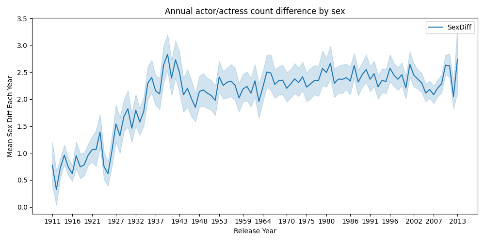

  

## Motivation
>“I raise up my voice—not so I can shout, but so that those without a voice can be heard...we cannot succeed when half of us are held back.” 

Gender discrimination refers to the unequal treatment or perception of individuals based on their gender.

The history of women's rights is a long and complex one, with significant advancements and setbacks over time. In the past, women have often been treated as second-class citizens, with limited rights and opportunities compared to men. In many societies, women have been denied the right to vote, own property, and receive an education. In the 19th and early 20th centuries, women's rights movements emerged in many countries, leading to the adoption of laws and policies that granted women greater legal rights and equality. Despite these advancements, women continue to face discrimination and inequality in many parts of the world, and the struggle for women's rights and gender equality continues.

It is then important that we further devote our effort into revealing the embedded discriminations, sometimes unseen and latent, to the focus of the views of public.

## What we did: a brief
 First, we claim the existence of gender difference by investigating the graphical structure of actors collaboration, the uneven distribution of actor ages upon participation and the distribution of actor's career span, the most frequency-diverged words across genders and the distribution of common words across genders; 
 After that, we tap into the evolutions of gender inequalities by investigating the gender composition in the movie industry, the distribution of actor age upon movie participation and career length, the most diverged words and the distribution of common words.

## Story logistics
First, we point out the existence of cross-gender differences and stereotypes (__gender effects__) in the movie industry by focusing on:
- The gender composition among top actors/actresses in history;
- The society's diverged expectation upon male/famale actors;
- The graphical structure and properties of top actors' collaboration;
- The uneven distribution of actor ages upon participation and their career span;
- The most frequency-diverged words in the plot summaries across two genders.
- The distribution difference of common words across gender

Then, we shift our interest on the evolution of gender effects over time by investigating:
- The gender composition in the movie industry;
- The change of distribution of actors' career span on a decade-scale;
- The most frequency-diverged words over time;
- The distribution of common words across genders over time.

       
## The data
We obtain the data from the [CMU Movie Summary Corpus](http://www.cs.cmu.edu/~ark/personas/), in which contains data about different movies, characters and actors in different movies and the plot summary of movies.

The __movie data__ is composed of: 
- `wikipedia_id`: Wikipedia movie ID
- `freebase_id`: Freebase movie ID
- `name`: Movie name
- `release_date`: Movie release date
- `box_office_revenue`: Movie box office revenue
- `runtime`: Movie runtime (in minutes)
- `languages`: Movie languages (Freebase ID:name tuples)
- `countries`: Movie countries (Freebase ID:name tuples)
- `genres`: Movie genres (Freebase ID:name tuples)

The __character data__ is composed of:
- `wikipedia_id`: Wikipedia movie ID
- `freebase_id`: Freebase movie ID
- `release_date`: Movie release date
- `character_name`: Character name
- `actor_dob`: Actor date of birth
- `actor_gender`: actor_gender
- `actor_height`: Actor height (in meters)
- `actor_ethnicity`: Actor ethnicity (Freebase ID)
- `actor_name`: Actor name
- `actor_age`:actor_age
- `freebase_character_map`: Freebase character/actor map ID
- `freebase_character_id`: Freebase character ID
- `freebase_actor_id`: Freebase actor ID

The __plot data__ contains plot summaries of 42,306 movies extracted from the November 2, 2012 dump of English-language Wikipedia.  Each line contains the Wikipedia movie ID (which indexes into movie.metadata.tsv) followed by the summary.

---

>I've seen things you people wouldn't believe. Attack ships on fire off the shoulder of Orion. I watched c-beams glitter in the dark near the Tannhäuser Gate. All those moments will be lost in time, like tears in rain. Now, time to...
       
#### Tell the story!

 <h1>The Existence of Gender Effects</h1> 

### The famous actors: what are their characteristics?

Actors are an essential part of the movies, and the movies in which the two actors have worked together can be seen as the connect between these two actors, which contributes to a very big social network. With the help of such a network structure, we can find out the structural gender difference in the movies.

We start to build up the graph with the prepared nodes and edges data. We use `nx.Graph()` to generate an empty undirected graph and load our prepared data. In our social network graph, every actor represents a node and there is a edge between two nodes if the two actors have cooperated at least one movies. **The more degrees the node has, the more influential the actor is**.

First we select the top 100 nodes which have the most degrees, which means that they represent 100 most influential actors. We name the original graph G and this subgraph G100. After obversing the gender distribution in graph G and G100, we can find that there are only eight females in the Top100 actors, which shows that in social network of actors the male actors occupy the absolute main force.

  

 <b>Figure 1:</b> <i> The number of female and male actors in TOP 100 ranking</i> 

After filtering some height outliers, we analyse the height difference in G and G100 between male and female actors. The p-value of T-test for the average height of male between Top100 and all actors is **0.61**, which shows that they are different in fact. So we can find that for female actors, who are in Top100 are usualy taller, but for male actors, who are in Top100 almost the same as the average or even shorter than average. It is a fact that taller people are more likely to become an actor or appear in the movies. Furtherly we can make a conclusion that Society has broad height requirements for male actors, but it often has higher requirements for women.

  

 <b>Figure 2:</b> <i> Average height of famous/all actors across genders</i> 

Finally, we generate male subgraph G_male and female subgraph G_female from the social netowrk graph G and compute structural features on them to explore the structural gender difference. 

  

 <b>Figure 3:</b> <i> structural features of the total graph and  gender subgraphs</i> 

It is interesting that although male actors's nodes have more average degrees in male subgraph, which means that there are more cooperations in the film and television industry between male actors, female actors actually have more stable partnerships with female actors accroding to the higher transitivity value of gender subgraphs and higher clustering coefficient of specific actors

One convincing explanation is that the number of female actors is less than the male actors, so for every specific kind of female character group in the movies, there are few potiental female candidates, and that is why there is more stable cooperation relationship between female actors.
      
### Actors' careers: is there a gender effect?

In this part, we investigate how female and male actors differ in their careers. We plot the average age evolution of female and male actors. It is interesting to see the average ages of both female and male actors increase over time, while in general female actors are almost always younger than male actors.

  

 <b>Figure 4:</b> <i> Average age of participating actors upon movie release</i> 

We then plot the distribution of actors' age upon participation of movies, for the same actor participating in different movies, we count separatedly.

  

 <b>Figure 5:</b> <i> Age distribution of female actresses upon movies participation</i> 

  

 <b>Figure 6:</b> <i> Age distribution of male actors upon movies participation</i> 

The peak of character ages are in about 20s to 30s for both female and male, while also slight difference exists. The peak of male characters comes a bit later than female characters.

Besides the peak shift, we see the hist of female age distribution "thinner" than that of male age distribution, which probably means shorter career span. To be more precise, we sort the data with actors with their charaters. The career span in year is then computed from the difference of latest and ealiest character. 

Below is the figure of general career span distribution. We could conclude that female actors generally have shorter career span than male actors, while most actors only have 1 year of career span, meaning only have starred in 1 movie. 

  

 <b>Figure 7:</b> <i> Cumulative density function of female and male actors' strred age span</i> 

      
### Words count! What do we know from the plots?

We also want to study the plot summaries in the movies. We aim to discover whether gender stereotypes exist in the movie plots. We defined gender stereotypes as the presence of gender-neutral words biased towards describing male or female characters. We consider relevant words for characters as the first or last two words of a verb or adjective from the character name within sentences in plot summaries. We extract relevant words around these names by gender and count the log frequency of words related to different genders.

For qualitative analysis, we look at the differences in frequencies of words between genders and rank the verbs and adjectives based on this difference. as the most-distinguishable words for men and women.

  

 <b>Figure 8:</b> <i> Top 20 words with largest frequency difference according to genders</i> 

We can find that men and women have more distinct word preferences. For the verbs and adjectives, males are associated with crime (kill, shoot, fight, arrest, dead, criminal.), power (lead, manage, powerful), and politics (corrupt), while females are depicted with the word marriage (marry, marriage), love, reproduction (pregnant), appearance (beautiful) and sex (seduce, sexual).

For quantitative analysis, we compare the distributions of verb or adjectives frequencies between men and women. We use a __chi-square test__ to see if the difference is significant and adopt __KL divergence__ to measure how different the two distributions are. The p-value in the chi-square test is close to zero, indicating the difference is significant. The KL divergence is 0.07 and 0.16 for verbs and adjectives, see our code base for more details!

 <h1>Time Evolution of Gender Effects</h1> 

#### Are women gaining more places in the industry?
       
We are interested in how gender composition in the movie industry evolves. To answer these questions, we first derive the annual gender composition in the movie industry.

  

 <b>Figure 9:</b> <i> Annual actor, actress count average by sex </i> 

With the annual actors count by sex in hand, we are able to investigate into the gender composition in the movie industry by time.

Note that we have huge data variance in the first the last few years, data may not be representative. The pattern we observe here is somewhat different.
We are interested in how may films are released in each year. If there are few films released that year, data at that year may not be repesentative.
According to analysis (see details in our codebase!) We crop the head and tail of the original data to make results more confident.

  

 <b>Figure 10:</b> <i> Annual actor/actress count average difference with 95% confidence interval </i> 

Then, we look at the ratio of male actors count against the female actresses count by year.

  

 <b>Figure 11:</b> <i> Annual actor/actress count average ratio </i> 

It is not hard to see that the __portion__ of female actors first decreases then increases, while the absolute number of female actors keeps increasing after around 1942.

We explain that:

$$\frac{Male}{Female} = f(t)$$

Therefore we have:

$$Male - Female = Female(f(t) - 1)$$

We observe that:
- $Male - Female = Female(f(t) - 1)$ increases to summit at 1941, then decreases and stays stable.
- $\frac{Male}{Female} = f(t)$  increases to summit at 1941, then decreases all the way.

We conclude that the ratio of male-female attendance in films first increases then decreases. But genreally there are more men than women in the movie industry.

To count for the stable variation of actors count difference, we explain that it is because the increase of absolute number of women actress.

#### Actors' careers: from decades' perspective

Below is the figure of the evolution of career span distribution through different decades. We see the difference between genders is narrowing. (Except for the last plot for actors born from 1990 to 2000, but those may be too young to say about a entire career span.) It may be because of increasing awareness of female rights.

  

 <b>Figure 12:</b> <i> Career span for female and male actors born in different decades </i> 

### Plots: what does their variety over time inform?
Then we wonder if the gender stereotype evolves with time. We will still use qualitative and quantitative analysis. We group the movies by the release date and cut them by decades.



 <b>Figure 13:</b> <i> Top 20 verbs with frequency difference according to genders in different times </i> 

We only show the verbs here. The results of adjectives are similar. We can find that the trends are similar and coherent with the overall analysis. However, we notice a decrease in absolute value by looking at the scale of the x-axis. This may tell us that the bias exists, but it is decreasing with time. Our quantitative analysis further argues this point. We do a regression analysis between KL divergence and decades.

  

 <b>Figure 14:</b> <i> Linear regression between KL divergence and decades </i> 

We could see that the KL divergence is decreasing, so gender stereotype exists but decreases with time. We also compare the gender stereotypes between genres, but that's not part of our main story and you can see the notebook for details.

 <h1>Conclusion and Implication</h1> 

       
In this report we presented the existence and evolution of gender effects in the movie industry from the movie dataset obtained. We find that such gender effect does appear and is significant. However the good news is such effect is easing as time goes by.
